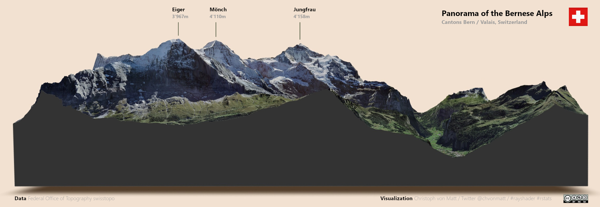

# Jungfrau Panorama / Panorama of the Bernese Alps

Code, Visualization and Movie-Clip of a panoramic view of the Bernese Alps.

**This repository contains:**
- Script used to create both visualization + movie
- Movie-clip (README.md)
- Visualization

**Steps not included in the Script:**
- Downloading data via swisstopo (see Script for Links)
- Merging / Cropping Tiles in Quantum GIS (QGIS)
- Video editing (VSDC Free Video Editor)
- Image editing & labelling using GIMP

### Movie-Clip

### Visualization

## Licence
**This work is licenced as follows:**
- **Code:** GNU GPL v3.0
- **Movie clip & Visuazilation:** CC-BY-NC-SA 4.0
